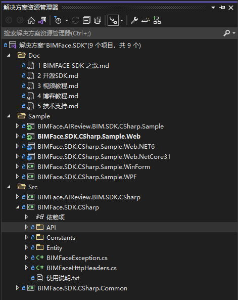
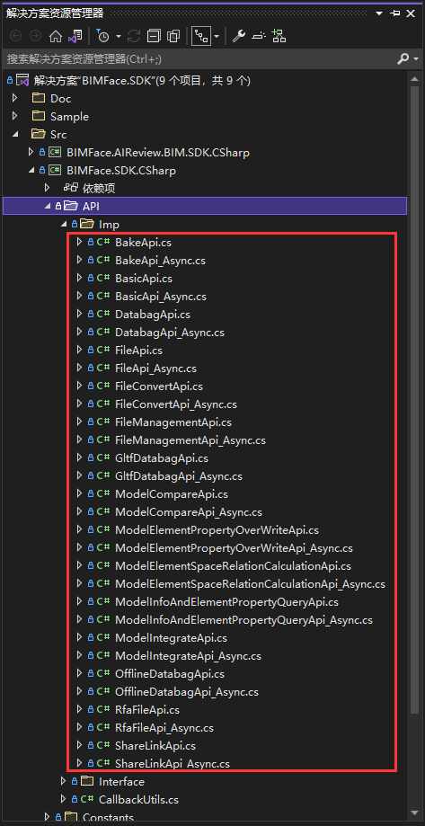

# BIMFace.SDK

## 特别声明

BIMFace.SDK 项目已加入 [dotNET China](https://gitee.com/dotnetchina)  组织。 

#### 介绍
【 **BIMFace.SDK** 】是由BIMFACE社区参与者、贡献者、产品深度用户  **张传宁**  提供的开源免费SDK。支持.NET Framework、.NETCore3.1、.NET5、.NET6、.NET7 开发，支持 Windows、Linux、MacOS跨平台系统部署运行。

大家在使用过程中，如遇到任何问题请联系作者，QQ群：1026017846  微信：savionzhang。

#### 功能简介

【 **BIMFACE.SDK.CSharp** 】 是基于微软 .NET Standard 技术封装的用于 BIMFACE 二次开发的通用类库。其中封装了BIMFace服务端API，包含

- 基础API
- 文件上传API
- 文件转换API
- 模型集成API
- 模型对比API
- 模型碰撞检测API
- 模型构建属性重写API
- 模型信息和构建属性查询API
- 构建空间关系计算API
- 转换/集成/对比数据包相关API
- 离线数据包API
- 导出数据包相关API
- 烘焙API
- rfa构建数据API
- 分享链接API
- 回调API等服务器端接口
- 文档管理API

#### 软件架构
本项目使用 VS2019 创建，建议使用VS2019或者VS2022版本打开该项目。

#### 使用说明

1、下载完整项目，使用VS2019/VS2022打开该项目。

2、重新生成解决方案。 

3、项目结构说明 

（1）Src/BIMFace.SDK.CSharp.Common 为项目公用类库。 

（2）Src/BIMFace.SDK.CSharp 里面包含了BIMFACE服务器端端基础API、文件上传API、文件转换API、模型对比API、生成离线数据包API、文档管理API等。 

（3）Src/BIMFace.AIReview.BIM.SDK.CSharp 是基于BIMFACE进行人工智能审查的SDK。

（4）Sample/BIMFace.SDK.CSharp.Sample.Web 是 ASP.NET WebForm 测试程序，测试封装的API示例。编译时会自动还原NuGet包。

（5）Sample/BIMFace.SDK.CSharp.Sample.Web.NET6 是 ASP.NET Core 6.0 测试程序，测试封装的API示例。编译时会自动还原NuGet包。

（6）Sample/BIMFace.SDK.CSharp.Sample.Web.NetCore31 是 ASP.NET Core 3.1 测试程序，测试封装的API示例。编译时会自动还原NuGet包。

（7）Sample/BIMFace.SDK.CSharp.Sample.WinForm 是WinForm客户端测试程序，提供客户端集成BIMFace应用的多种解决方案。

（8）Sample/BIMFace.SDK.CSharp.Sample.WPF 是WPF客户端测试程序，提供客户端集成BIMFace应用的多种解决方案。

（9）Sample/BIMFace.AIReview.BIM.SDK.CSharp.Sample 是 ASP.NET WebForm 测试程序，测试封装的API示例。编译时会自动还原NuGet包。

4、Sample结构下为SDK测试程序，每个示例程序里面有详细的使用说明，阅读后再测试。

#### 使用教程

- 博客教程

  《C#二次开发BIMFACE系列》https://www.cnblogs.com/SavionZhang/p/11424431.html

 

- 视频教程

《C#二次开发BIMFACE视频系列》https://space.bilibili.com/495216530/video

大家在使用过程中，如遇到任何问题请联系作者，QQ：905442693 微信：savionzhang。